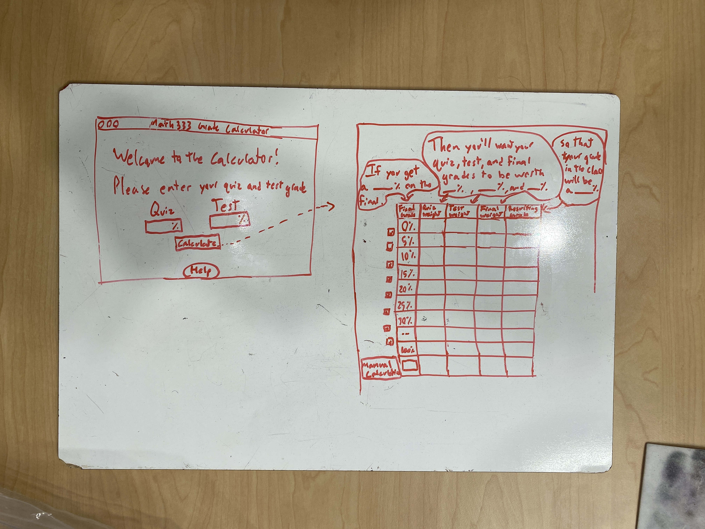

# MATH333GradeCalculator
A grade calculator for Prof. Brill's MATH333 class to calculate the best weighted values for your grades, following his guidelines on how grades are calculated.

## What each file is for
-Driver.java has the main method that opens the main menu.

-MainMenu.java is the constructer for the main menu window. 

-MainMenuResources.java contains the logic happening in the main menu

-Help.java is the help window

## Important Info
All the math in this project will be done with ints, not doubles. So instead of working with a percentage like 89.56%, we will be working with an int like 8956. This makes the math easier for the computer to do since it will be iterating through milions of possiblities to find the best grades.

## Goals
- code the logic behind the calculator
- create display to display the calculator's findings
- make everything look better
- fill out help window (only when done with everything else)

## Layout idea for calculation page

### info for next time
I left off on line 154 in MainMenu.java. Need to create a class to recieve the information and compute it.
